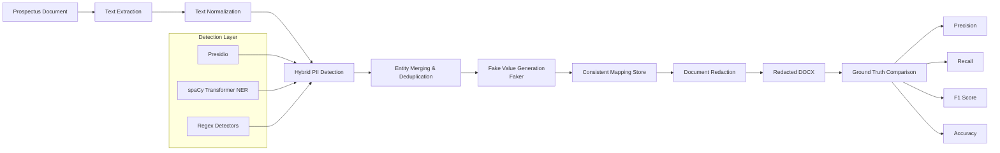

# PII Redaction Tool

## Overview

This project implements a robust, automated **Personally Identifiable Information (PII)** redaction pipeline designed specifically for financial and legal documents, such as Red Herring Prospectuses (RHPs).

This is a **hybrid appproach** which involves:
- Presidio
- custom regex
- spacyNER with regex constarints

This maps each value with higher accuracy.

---

## Supported PII Types

| Entity Type              | Detection Method                  |
|--------------------------|-----------------------------------|
| Person Names             | Presidio + spaCy NER              |
| Email Addresses          | Regex                             |
| Phone Numbers            | Regex + Presidio                  |
| Organizations / Companies| Presidio + spaCy NER              |
| Locations / Addresses    | Presidio + spaCy NER              |
| Dates of Birth           | Regex                             |
| Credit Card Numbers      | Regex                             |
| Social Security Numbers  | Regex                             |
| IP Addresses             | Regex                             |

---
## System Architecture



### 1. Microsoft Presidio
Provides reliable, production-grade detection for common PII categories:
- `PERSON`, `LOCATION`, `ORGANIZATION`
- `EMAIL_ADDRESS`, `PHONE_NUMBER`

### 2. spaCy NER and cross-regex validation
Serves as a complementary detector using a transformer-based model to improve recall on:
- Person names
- Organizations
- Locations and geopolitical entities

### 3. Custom Regex Rules
Delivers high-precision pattern matching for structured data:
- Email addresses
- Phone numbers (international & local formats)
- Social Security Numbers (SSNs)
- Credit Card Numbers
- IP Addresses
- Dates of Birth

---

## Redaction Strategy

Detected PII entities are replaced with realistic synthetic values generated using the **Faker** library.

### Replacement Examples

| Original                     | Redacted                        |
|-----------------------------|---------------------------------|
| Sarthak Malvadkar           | John Smith                      |
| sarthak@gmail.com           | john.smith@example.com          |
| KSH International Limited   | ABC Global Holdings Ltd         |
| +91 9876543210              | +91 9999999999                  |

**Consistency Feature**: A persistent replacement map ensures the same entity is replaced with the same synthetic value throughout the entire document, preserving logical consistency and readability.

---

## Evaluation Methodology

For valuation ground_truth.json. I decided to pick values manually but as the document size is very large. I decided to pick Grok_AI as an advanceed model to get my ground_truth.json. Predicted values are just generated by my model. Then valuation is compareed between the two models.

In Precision I kept the order and ticket values as changable because it matters. As sometimes when we have the ticket values by going to the official portal we can get the users personal information.

**Note:** No OCR technique is used as the document as there were no private images.

---

## Evaluation Results

### Per-Category Performance

| Category       | Ground Truth | Predicted | TP  | FP  | FN  | Precision | Recall | F1    |
|----------------|--------------|-----------|-----|-----|-----|-----------|--------|-------|
| PERSON         | 42           | 68        | 28  | 40  | 14  | 41.2%     | 66.7%  | 50.9% |
| EMAIL_ADDRESS  | 5            | 5         | 5   | 0   | 0   | 100.0%    | 100.0% | 100.0%|
| PHONE_NUMBER   | 3            | 3         | 2   | 1   | 1   | 66.7%     | 66.7%  | 66.7% |
| DATE_TIME      | 28           | 45        | 18  | 27  | 10  | 40.0%     | 64.3%  | 49.3% |
| LOCATION       | 12           | 18        | 7   | 11  | 5   | 38.9%     | 58.3%  | 46.7% |
| ORGANIZATION   | 35           | 62        | 22  | 40  | 13  | 35.5%     | 62.9%  | 45.4% |

### Overall Performance

| Metric                    | Value    |
|---------------------------|----------|
| Ground Truth Entities     | 125      |
| Predicted Entities        | 201      |
| True Positives            | 82       |
| False Positives           | 119      |
| False Negatives           | 43       |
| **Precision**             | **40.8%**|
| **Recall**                | **65.6%**|
| **F1 Score**              | **50.3%**|
| **Accuracy**              | **33.6%**|

---

## Observations

### Strengths
- Email address detection achieved perfect precision and recall (as regex is enough to get them)
- Strong and reliable detection of structured entities
- Hybrid approach meaningfully improved overall recall
- Consistent replacement mapping preserved document coherence

### Limitations
- Organization names generated the highest number of false positives due to complex legal and corporate terminology
- Date recognition occasionally misclassified non-sensitive corporate event dates
- Multi-line addresses and complex formatting remain challenging
- Person name detection sometimes confuses titles or corporate references with individuals

---

## Extensibility

The system is intentionally modular and designed for easy extension.

**Adding a new entity type requires**:
1. Creating a detection rule (Regex, Presidio, or spaCy)
2. Registering the entity type in the detector
3. Defining a synthetic replacement generator (Faker)
4. Updating the redaction dispatcher

**Potential Future Additions**:
- Aadhaar Numbers
- PAN Numbers
- Passport Numbers
- Driving License Numbers
- Bank Account Numbers
- IFSC Codes

---

## Project Structure

```text
project/
├── extractor.py          # Document text extraction
├── normalizer.py         # Text cleaning and normalization
├── pii_detector.py       # Hybrid PII detection engine
├── redactor.py           # Redaction logic + consistent mapping
├── rebuild_docx.py       # Rebuild formatted redacted document
├── input/
│   └── prospectus.docx
├── output/
│   └── redacted_prospectus.docx
├── requirements.txt
├── README.md
└── evaluation_report.md
